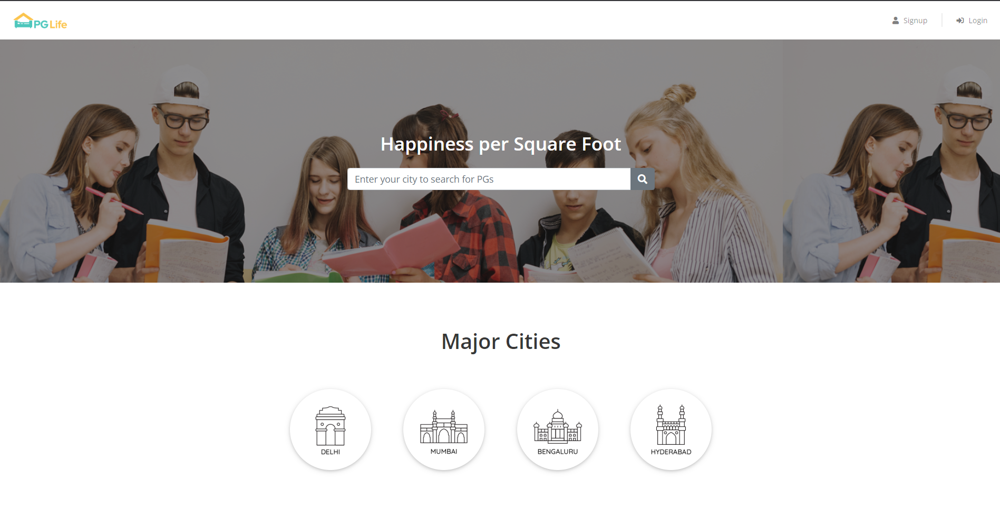
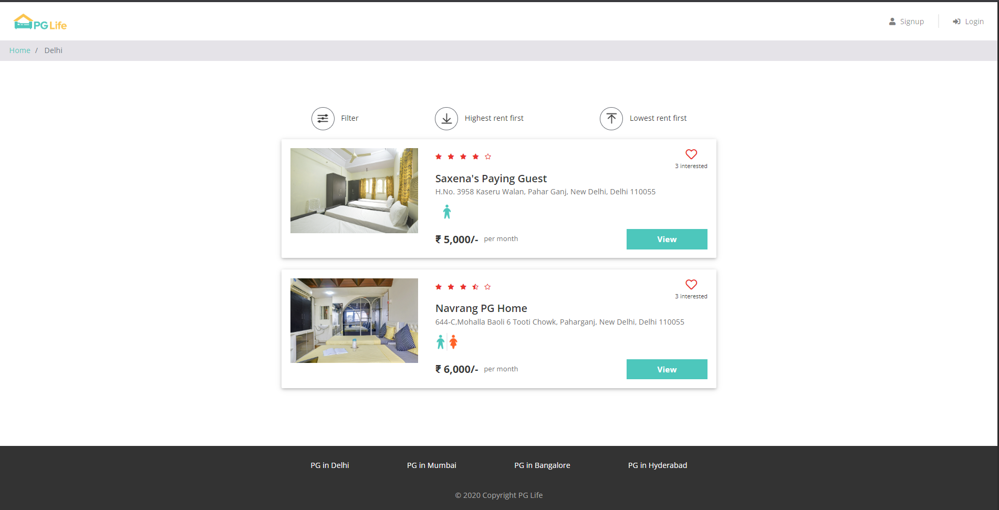
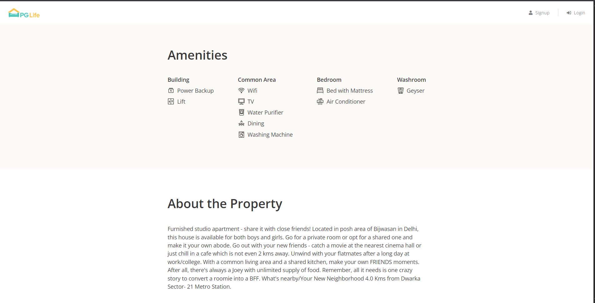
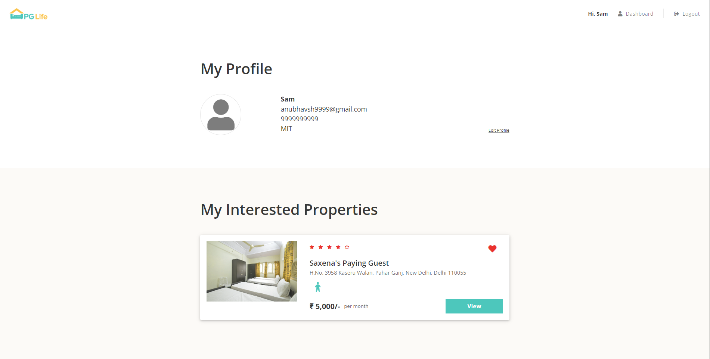
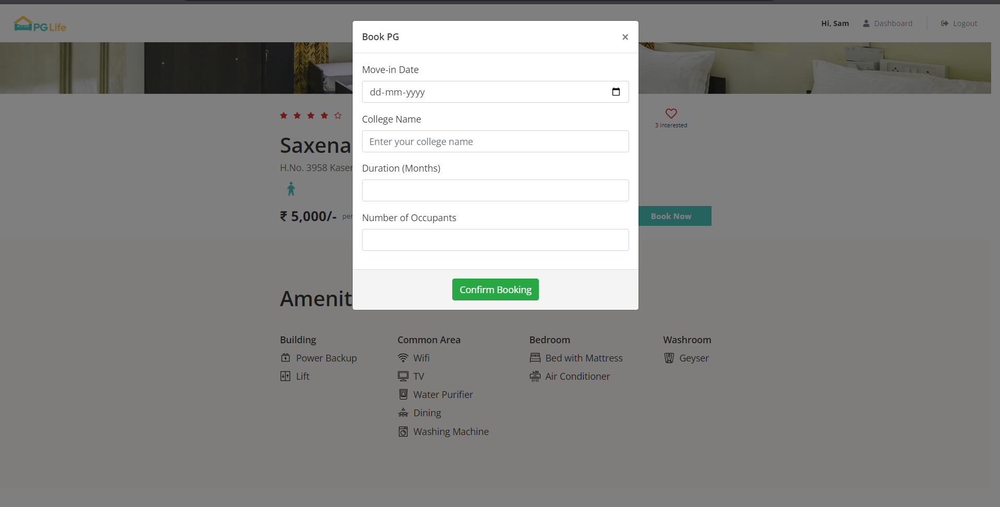

# 🏠 PGLife

A full-stack PG (Paying Guest) Accommodation Website developed using **PHP, MySQL, JavaScript, AJAX, Bootstrap, and React**. The platform allows students to search for PGs, view property details, express interest, book accommodations, and manage bookings through a personal dashboard.

## 🚀 Live Demo

**Website:** https://pglife-project.infinityfreeapp.com/PGLife/

## 📌 Features

* 🔐 User Signup & Login
* 🏠 Browse PG properties by city
* 🔍 Property details with amenities and ratings
* ❤️ Add/Remove Interested Properties (AJAX)
* 📅 Book a PG with:

  * College Name
  * Move-in Date
  * Duration
  * Number of Occupants
* 📋 Dashboard with:

  * Interested Properties
  * My Bookings
  * Cancel Booking
* 🎨 Responsive UI using Bootstrap
* ⚛️ React Component Integration

## 🛠️ Tech Stack

### Frontend

* HTML5
* CSS3
* Bootstrap
* JavaScript
* AJAX
* React

### Backend

* PHP

### Database

* MySQL

### Tools Used

* XAMPP
* phpMyAdmin
* VS Code
* Git
* GitHub
* InfinityFree (Deployment)

## 📷 Screenshots

### Home Page

### Property Listing

### Property Details

### Dashboard

### Booking

## ⚙️ Installation

1. Clone the repository.
2. Place the project inside the `htdocs` folder of XAMPP.
3. Import the `pglife.sql` database into phpMyAdmin.
4. Update the database connection in `includes/database_connect.php`.
5. Start Apache and MySQL using XAMPP.
6. Open `http://localhost/PGLife` in your browser.

## 👨‍💻 Author

**Anubhav Bhardwaj**

GitHub: https://github.com/Anubhavsh24
